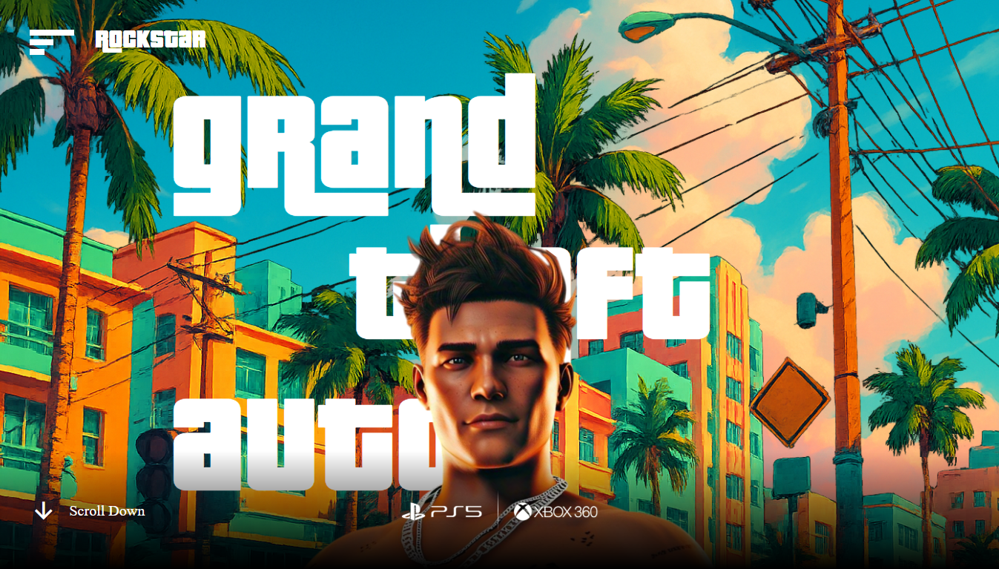
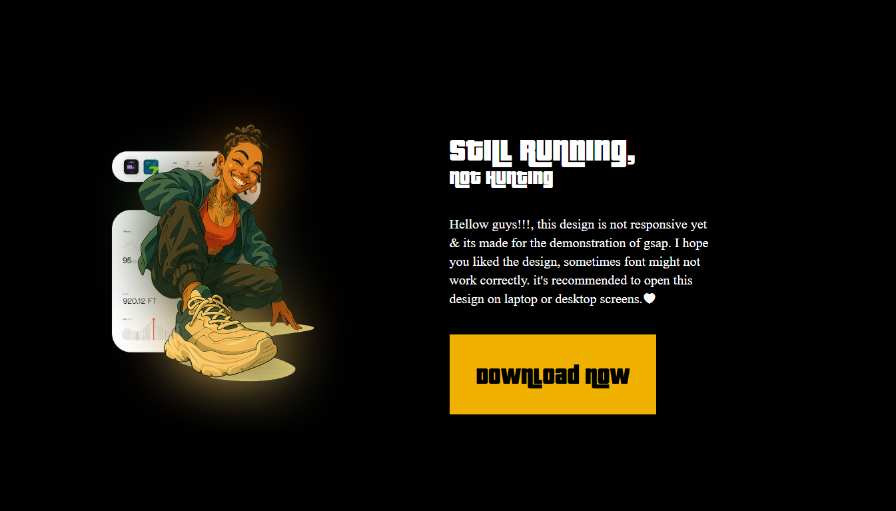

# 🎮 GTA-VI-Web-Design

This project is a **visually immersive web interface** inspired by the aesthetics and vibes of **GTA VI** — reimagined as a stylish, modern website. It’s **not a game**, but a frontend experiment pushing the boundaries of animated web experiences using **React** and **GSAP**.

  
  

## ✨ Features

- 🎨 **Immersive Visual Design** — edgy, neon-drenched UI inspired by the GTA VI trailer.
- 🎞️ **Smooth GSAP Transitions** — powered by GreenSock Animation Platform for fluid visuals.
- ⚙️ **Interactive Components** — built with React for fast, reactive UI elements.
- 📱 **Responsive Layout** — adapts beautifully to different screen sizes.

## 🚀 Tech Stack

- **React.js**
- **GSAP (GreenSock Animation Platform)**
- **HTML5 / CSS3 / JavaScript**
- **Responsive Design Techniques**

## 📸 Project Snapshots

